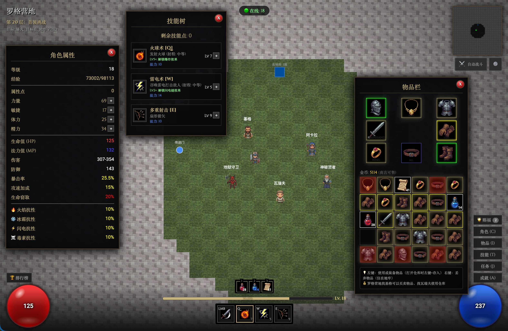

# 暗黑破坏神 Web版 (Diablo Web Remake)

这是一个初始使用 Gemini 3.0 Pro，后续使用 Claude code（Claude Opus4.5、Sonnet4.5Kimi k2）开发的纯前端页游，完全使用Vibe Coding 模式，不看一行代码。
基于 HTML5 Canvas 和原生 JavaScript 开发的动作角色扮演游戏 (ARPG)，致敬经典的《暗黑破坏神2》。游戏实现了核心的 ARPG 体验，包括随机无限地牢、地狱、装备系统、技能树、任务系统、成就、商店、以及实时战斗、自动战斗、存档系统、小地图、仓库、洗点、祝福等。

## 🎮 游戏特色

### 核心玩法
- **随机地牢**: 采用 Roguelike 元素的随机地图生成算法，每次进入地牢都是全新的体验。
- **实时战斗**: 流畅的动作战斗系统，支持近战攻击和多种魔法技能。
- **城镇枢纽**: 经典的“罗格营地”作为安全区，包含商人、治疗者和任务 NPC。

### 角色成长
- **属性系统**: 升级获得属性点，可自由分配到力量、敏捷、体力、精力。
- **天赋系统**: 每次进入新楼层时弹出天赋商店，可购买各种天赋强化角色。
- **技能树**:
  - 🔥 **火球术 (Q)**: 发射火球，中等射程，**Lv5+ 解锁爆炸效果**。
  - ⚡ **雷电术 (W)**: 召唤雷电打击敌人，短射程，**Lv2+ 解锁闪电链效果**。
  - 🏹 **多重射击 (E)**: 发射扇形箭矢，适合群体攻击，远程。
- **等级系统**: 击杀怪物获得经验值，最高等级无上限（软上限取决于怪物经验）。

### 物品与装备
- **装备系统**: 包含头盔、护甲、武器、盾牌/副手、手套、腰带、鞋子、戒指、项链等多个部位。
- **词缀系统**: 装备分为普通(白)、魔法(蓝)、稀有(黄)、暗金(金)、套装(绿)五个品质。魔法及以上装备拥有随机词缀（如"残忍的"、"之熊"等），提供额外的属性加成。
- **套装系统** (9套54件):
  - 🟢 **塔拉夏的外袍**: 法师套装，强化法力和火焰（6件: 火伤+200, 暴击+10%）
  - 🟢 **不朽之王**: 战士套装，强化物理攻击（6件: 伤害+450%, 防御+150）
  - 🟢 **暗影舞者**: 刺客套装，强化暴击和攻速（6件: 暴击+35%, 伤害+150%）
  - 🟢 **娜塔亚的复仇**: 亚马逊套装，强化闪电和弓箭（6件: 闪电+250, 伤害+200%）
  - 🟢 **格里斯沃尔德的传承**: 圣骑士套装，强化防御和生存（6件: 伤害+300%, 防御+200）
  - 🟢 **庄·欧的化身**: 死灵法师套装，强化毒素和法力（6件: 毒伤+300, 伤害+100%）
  - 🟢 **奥杜尔的节拍**: 德鲁伊套装，强化生命恢复（6件: HP+400, 伤害+200%）
  - 🟢 **马维娜的战斗颂歌**: 狂战士套装，强化狂暴伤害（6件: 伤害+400%, 暴击+25%）
  - 🟢 **希冈的钢铁**: 混沌套装，全属性均衡提升（6件: 全属性大幅提升）
  - 套装掉落：BOSS 10-15%概率，精英怪 1.5-6%概率，普通怪 0.3-5%概率（受层数和幸运值影响）
- **物品栏**: 经典的网格背包系统（30格），支持物品拖拽、装备和使用。
- **仓库系统**: 私人仓库（36格），可在罗格营地找瓦瑞夫存取物品，与背包互通。
- **腰带系统**: 快捷使用药水和回城卷轴（支持数字键1/2/3快速使用）。
- **赌博与商店**: 可以在基格处购买基础物资，或花费金币进行装备赌博。
- **药剂音效**: 使用治疗/法力药剂时播放逼真的咕噜噜音效。
- **天神赐福**: 每5级触发一次，可获得赐福，赐福有6种类型，每种类型有3个词条，每个词条有3个效果，效果有永久加成和临时加成两种。

### 任务系统
- 包含 **10 个章节任务**，从“邪恶洞窟”到“世界之石要塞”。
- 每个任务都有特定的完成条件（如击杀特定 Boss 或清理怪物）和丰厚的奖励（技能点、金币、稀有装备、暗金装备、传奇装备）。
- 任务难度随层数增加，后期任务奖励更珍贵。

### 怪物与战斗系统
- **AI类型**: 近战追击、远程攻击、复活友军（巫师）、任务BOSS。
- **怪物种类**:
  - **沉沦魔** (1-10层): 基础近战怪物
  - **骷髅弓箭手** (2+层): 远程怪物，发射可视箭矢攻击
  - **沉沦魔巫师** (3+层): 可以复活死去的沉沦魔
  - **精英怪** (10%概率): 更强的普通怪物，橙色名称
  - **任务BOSS** (特定层): 血鸟、女伯爵、屠夫、树头木拳、暗黑破坏神、巴尔
- **怪物显示**: 所有怪物显示名称，颜色区分稀有度（Boss红色、精英橙色、普通灰白），血条在怪物头顶。
- **远程战斗**: 骷髅弓箭手射出黄色箭矢，有真实的箭矢飞行轨迹和音效。
- **技能平衡**: 所有技能设置合理射程限制，防止远距离狙击。

### 自动战斗系统
- **智能AI**: 按 `F` 键开启/关闭自动战斗，解放双手！
- **A*寻路**: 智能路径规划，自动绕过墙壁和障碍物
- **战术配置**:
  - ⚔️ 优先使用技能（火球术/雷电术/多重射击）
  - 🏃 保持安全距离（远程战术，默认150像素）
  - 💊 自动使用药水（HP < 30%喝红，MP < 20%喝蓝）
  - 🏠 紧急回城（HP < 15%自动使用回城卷轴）
- **自动拾取**:
  - 💰 自动拾取金币
  - 🧪 自动拾取药水和回城卷轴
  - 💎 自动拾取暗金装备
  - 🟢 自动拾取套装装备
- **防卡死机制**: 智能检测摇摆和卡墙状态，自动调整路径
- **设置面板**: 点击自动战斗按钮打开设置界面，自定义战术参数

### 其他功能
- **自动存档**: 游戏利用 IndexedDB 自动保存角色状态、装备和任务进度。
- **小地图**: 实时显示已探索区域、敌人位置和出入口。
- **音效系统**: 包含背景音乐、战斗音效（支持开关）。
  - 🎵 **背景音乐**: 沉浸式地牢音乐
  - ⚔️ **战斗音效**: 攻击、受伤、火球（逼真三层叠加）、箭矢（风声）、药剂（咕噜噜）
  - 🎊 **特殊音效**: 任务完成、升级、金币拾取
- **背包系统**: 智能背包管理，背包满时点击拾取会显示提示信息。
- **怪物刷新**: 击杀怪物后系统会自动刷新新的怪物，确保地牢始终有挑战。
- **深度难度**: 地牢层数越深，怪物血量和强度越高，提供持续挑战。
- **BOSS掉落**: BOSS必定掉落2件高品质装备（保底蓝装，45%黄装，8%暗金），以及3倍金币。

### 成就系统
游戏包含 **8 个精心设计的成就**，为玩家提供长期目标和挑战：

| 成就名称 | 描述 | 类型 |
| --- | --- | --- |
| 🗡️ **沉沦魔克星** | 击杀1000只沉沦魔 | 击杀类 |
| 🏔️ **地牢征服者** | 到达地牢第10层 | 探索类 |
| 💎 **暗金收藏家** | 收集全套暗金装备 | 收集类 |
| 🛡️ **钢铁意志** | 从未死亡到达第10层 | 挑战类 |
| 👹 **BOSS猎人** | 击败5个首领级敌人 | 击杀类 |
| ⭐ **传奇英雄** | 达到等级30 | 成长类 |
| 🎁 **套装收藏家** | 收集任意一套完整套装（6件） | 收集类 |
| 👑 **套装大师** | 同时穿戴一套完整套装（6件） | 装备类 |

**成就追踪**: 所有成就进度实时追踪，完成后自动获得并播放特殊音效和通知提示。
**成就界面**: 按 `A` 键或点击菜单"成就"按钮查看进度，支持自定义滚动条样式。

## 🕹️ 操作指南

### 键盘控制
| 按键 | 功能 |
| --- | --- |
| `Q` | 释放 火球术 |
| `W` | 释放 雷电术 |
| `E` | 释放 多重射击 |
| `F` | 开启/关闭 自动战斗 |
| `1` | 使用腰带第1格物品 (治疗药剂) |
| `2` | 使用腰带第2格物品 (法力药剂) |
| `3` | 使用腰带第3格物品 (回城卷轴) |
| `C` | 打开/关闭 角色属性面板 |
| `I` / `B` | 打开/关闭 物品栏 |
| `T` | 打开/关闭 技能树 |
| `J` | 打开/关闭 任务日志 |
| `A` | 打开/关闭 成就界面 |
| `Enter` | 交互 (进入地牢/传送门/下一层) |
| `Alt` | 显示地面物品标签 (点击标签拾取) |

### 鼠标控制
- **左键点击地面**: 移动角色。
- **左键点击敌人**: 攻击敌人 (按住可持续攻击)。
- **左键点击 NPC**: 对话/交易（基格=商店，阿卡拉=任务/治疗，瓦瑞夫=仓库）。
- **右键点击**: 释放当前选中的技能。
- **物品操作**:
  - 左键点击背包物品：使用或装备（打开仓库时左键=存入仓库）
  - 右键点击背包物品：丢弃物品（仅在非罗格营地）
  - 点击地面掉落物标签：拾取物品
- **技能提示**:
  - 法力不足时会提示需要多少法力
  - 选择未学习的技能时会提示"技能未学习"

## 🛠️ 技术栈

- **前端核心**: HTML5 Canvas API (用于渲染游戏画面和小地图)
- **逻辑实现**: Vanilla JavaScript (ES6+), 无任何第三方库依赖
- **数据存储**: IndexedDB (浏览器本地数据库)
- **样式布局**: CSS3 (Flexbox/Grid 用于 UI 界面)

## 📝 开发日志

- **v1.0**: 基础引擎完成，实现地图生成、移动和碰撞检测。
- **v1.1**: 加入战斗系统、怪物 AI 和掉落系统。
- **v1.2**: 完善 UI，加入物品栏、装备栏和属性面板。
- **v1.3**: 实现任务系统和 NPC 交互。
- **v1.4**: 加入音效系统和存档功能。
- **v1.5**: 新增仓库系统（瓦瑞夫）、右键丢弃物品、技能施放提示、怪物血量随深度增加、BOSS掉落优化、任务数量扩展至10个。
- **v1.6**:
  - **音效优化**: 添加药剂音效（咕噜噜）、优化火球术音效（三层叠加）、新增箭矢音效
  - **游戏平衡**: 为所有技能添加射程限制（火球术中等、雷电术中等、多重射击远程）
  - **怪物系统**:
    - 所有怪物显示名称（Boss红色、精英橙色、普通灰白）
    - 优化名称和血条位置，避免遮挡怪物
    - 修复远程怪物攻击自己的bug
    - 骷髅弓箭手发射可视箭矢（黄色线条）并有专属箭矢音效
  - **UI改进**: 技能界面显示射程信息
  - **系统优化**: 背包满时点击拾取物品会显示提示信息（替换原来的alert）
- **v1.7**:
  - **全新成就系统**: 添加6个精心设计的成就
    - 击杀、探索、收集、挑战、成长多种类型
    - 实时进度追踪，完成后自动通知
    - 自定义滚动条样式的美观成就界面
  - **键盘快捷键**: 添加 `A` 键快速打开成就界面
  - **玩家状态追踪**: 新增死亡标记，用于成就判定
  - **存档安全**: 清除存档添加二次确认对话框，显示当前存档信息（等级、位置），防止误操作
  - **UI优化**: 仓库面板位置调整至屏幕右侧，避免遮挡NPC
  - **Bug修复**: 修复仓库面板"一闪而过"的闪烁问题，现在点击瓦瑞夫稳定显示
  - **视觉调整**: 墙壁颜色稍微调亮，改善地牢可见度
- **v1.8**:
  - **游戏机制优化**:
    - 从远处点击物品后，角色会自动移动到物品处并完成捡取（无需二次点击）
    - 法力不足时的提示现在显示在角色上方，而非游戏顶部（更直观）
    - 经验进度条新增百分比显示（精确到小数点后2位）
  - **本地化完善**:
    - 所有属性文本完全本地化（如 Def → 防御，Dmg → 伤害）
    - 物品属性提示现在正确显示中文名称
  - **UI/UX 改进**:
    - 修复物品栏提示有时会被物品栏本身遮挡的层级问题
    - 购买物品时增加金币减少的浮动文字提示
    - 将浮动文字系统改为DOM元素实现，解决被商店等面板遮挡的问题
    - 所有alert弹窗替换为游戏内浮动提示，避免打断游戏流程
  - **游戏平衡调整**:
    - **大幅增强BOSS血量和攻击力**：
      - **血量 (HP)**:
        - 第1个BOSS: 200 → **300** (+50%)
        - 第5层BOSS: 400 → **800** (+100%)
        - 其他BOSS: 基础公式增强为 `(150 + f² × 25) × (1 + f/10)`，第10层BOSS从约1000提升至**4000+**
      - **伤害 (Dmg)**:
        - 第1个BOSS: **25** (原为20)
        - 第5层BOSS: **40** (原为30)
        - 其他BOSS: 20 + f × 3 (原为15 + f × 2)，第10层从35提升至**50**
      - **速度 (Speed)**: 90 + floor/3，随楼层递增
      - **碰撞半径**: 25 → **30** (更容易击中)
      - **经验值**: 1000 + f×200 → **1500 + f×300**
    - 怪物复活时会自动调整位置，确保距离主角150-250像素，避免过近
  - **Bug修复**:
    - 修复可以隔墙物理攻击怪物的问题（增加视线检测）
    - 修复打到怪物时掉血显示浮点数的bug（改为取整显示）
    - 修复第9层打死BOSS暗黑破坏神时卡死的bug（saveGame函数未定义）
    - 捡取物品时如果背包满了，会在角色上方显示红色浮动提示
    - 购买物品时如果背包满了，同样显示浮动提示并返还金币
- **v2.0** - 🎉 **核心玩法系统重大更新**:
  - **🔥 抗性系统**:
    - 新增火焰、冰霜、闪电、毒素四大抗性属性
    - 抗性上限75%，下限-100%
    - 元素伤害计算：怪物攻击可附带元素伤害，受对应抗性影响
    - 属性面板显示四种抗性，颜色区分（火焰红、冰霜蓝、闪电黄、毒素绿）
  - **⚔️ 装备词缀系统大幅扩展** (从10种→40+种):
    - **抗性类词缀**: 火抗、冰抗、雷抗、毒抗、全抗
    - **元素伤害词缀**: 火焰/冰霜/闪电/毒素伤害
    - **特殊效果词缀**:
      - 生命/法力回复、格挡几率、反射伤害、伤害减免
      - 暴击伤害、护甲穿透、击退、减速、连击
      - 攻击等级、魔法发现
    - 所有新词缀在提示框中用独特颜色显示，一目了然
  - **👹 精英怪词缀系统** (12种特殊能力):
    - **进攻型**: 极速(+50%速度)、强力(伤害翻倍)、火焰/冰冷/闪电强化
    - **防御型**: 石肤(减伤50%)、魔法抗性(技能伤害-70%)
    - **特殊效果**: 吸血、法力燃烧、诅咒、多重射击、幽灵打击
    - 精英怪随机获得1-2个词缀，词缀名称彩色显示在怪物名称上方
    - 词缀效果实时反馈（如"抗性!"、冰冻、吸血治疗等浮动提示）
    - 死亡触发效果（如火焰强化怪死亡时产生范围爆炸）
  - **📜 装备需求系统**:
    - 所有装备（除药水卷轴）现在有等级、力量、敏捷需求
    - 需求计算规则：
      - 武器：基于伤害值，需要力量和敏捷
      - 防具：基于防御值，需要力量
      - 饰品：基于等级，需要少量力量/敏捷
      - 品质越高需求越高（魔法+2级、稀有+5级、暗金+10级）
    - 物品提示显示需求，满足显示灰色，不满足显示红色
    - 不满足需求时尝试装备会在角色头顶显示提示，拒绝装备
    - 大幅提升属性分配的策略性和角色规划深度
  - **游戏平衡**:
    - 属性分配现在至关重要：力量影响装备防具和武器，敏捷影响装备武器
    - 精英怪战斗更具挑战性和变化性
    - 装备选择需要平衡伤害、防御、抗性等多个维度
  - **代码架构优化**:
    - 伤害系统支持物理+元素混合伤害计算
    - 词缀系统使用回调模式 (applyStats, onDeath)
    - 向后兼容：同时支持旧版数字伤害和新版对象伤害格式
- **v2.1** - 🔥 **地狱模式**:
  - **解锁方式**: 击败第10层BOSS巴尔后，返回罗格营地与"地狱守卫"对话
  - **双地图系统**: 普通地牢(1-10层)和地狱(1-10层)完全独立
  - **地狱特性**:
    - 怪物血量×6，伤害×4，速度×1.3，经验×5，掉落品质×3.5
    - 所有抗性-100%
    - 怪物名字带"地狱"前缀（如"地狱沉沦魔"）
    - BOSS变为"地狱巴尔"等强化版本
  - **便捷传送**:
    - 营地NPC"地狱守卫"可双向传送
    - 地狱中BOSS房入口变为"返回营地"（避免深入死循环）
    - 死亡后自动重置为普通模式，防止状态混乱
  - **UI提示**: 左上角显示红色"地狱"指示器，层数显示为"地狱 X层"
  - **策略价值**: 玩家可随时返回普通难度刷装备，再挑战地狱
- **v2.2**:
  - **Boss 刷新机制**:
    - 击败每层 Boss 后，Boss 将在 5 分钟后重新生成
    - 增加了游戏的可重复游玩性和刷宝体验
  - **成就系统修复**:
    - 修复了“世界拯救者”成就（击败巴尔）在某些情况下无法正确触发的问题
    - 增加了对旧存档的兼容性支持，自动补全已完成但未记录的成就
  - **UI 改进**:
    - 优化了属性面板的抗性显示布局
    - 调整了地狱模式指示器的样式
- **v2.3**:
  - **新技能**:
    - **雷电术 (Thunder)**: 替换了原来的冰霜新星。
    - **效果**: 召唤一道闪电打击鼠标指向的单个敌人，造成基于智力的雷电伤害。
    - **视觉**: 炫酷的闪电链特效。
    - **音效**: 震撼的雷声。
- **v2.4**:
  - **代码优化与清理**:
    - 删除已废弃的 `player.difficulty` 字段
    - 删除未使用的难度配置属性（`immuneChance`、`doubleImmuneChance`、`resistancePenalty`）
    - 合并冗余的 `defeatedBaal` 和 `unlockedHell` 字段，简化地狱模式解锁逻辑
    - 删除无效的 `portalTimer` 计时器
    - 删除 `firstKillBaal` 冗余字段，统一使用成就系统的防重复机制
    - 修复未使用的循环索引变量，消除 TypeScript 诊断警告
  - **数据完整性提升**:
    - 扩展 `floorBossMap` 配置，现在包含所有6个任务Boss完整数据（血鸟、女伯爵、屠夫、树头木拳、暗黑破坏神、巴尔）
    - Boss血量数值已更新至v1.8平衡版本
  - **代码质量**:
    - 减少16行冗余代码（3735 → 3719行）
    - 消除5个冗余字段和3个未使用配置
    - 提高代码一致性和可维护性
- **v2.5**:
  - **⚡ 雷电术闪电链机制** - 技能深度强化：
    - **Lv1**: 单体攻击，无溅射（基础形态）
    - **Lv2**: 解锁闪电链！可跳跃1个次级目标（40%伤害）
    - **Lv3**: 次级目标伤害提升至50%
    - **Lv5**: 可跳跃2个目标（50% → 25%伤害衰减）
    - **Lv7**: 跳跃范围扩大（150 → 200像素）
    - **Lv10**: 可跳跃3个目标（60% → 30% → 15%递减）
  - **视觉效果提升**:
    - 新增闪电链特效：黄色电弧从主目标跳跃到次级目标
    - 闪电链带有发光效果，持续0.3秒后淡出
    - 主闪电和闪电链视觉差异化
  - **战术深度**:
    - 面对分散敌人 → 使用火球术单点爆发
    - 面对聚集敌人 → 使用雷电术连锁清理
    - 面对扇形包围 → 使用多重射击覆盖
  - **智能目标选择**:
    - 自动寻找最近的未击中敌人
    - 防止重复击中同一目标
    - 根据等级自动调整跳跃次数和范围
- **v2.6**:
  - **❄️ 移除玩家冰霜伤害系统** - 技能体系简化：
    - **删除内容**: 移除玩家装备的"寒冰的"词缀（+冰霜伤害）
    - **保留内容**:
      - ✅ 冰霜抗性词缀（"冰霜之"、"之抗冰"）- 用于抵抗精英怪的冰冷强化
      - ✅ 精英怪的"冰冷强化"词缀 - 怪物依然可以造成冰霜伤害和冰冻效果
    - **设计理念**: v2.3已将冰霜新星替换为雷电术，玩家不再拥有冰霜技能，因此移除冰霜伤害词缀使装备系统更符合技能设定
    - **战术影响**:
      - 玩家：火焰、闪电、毒素三系元素伤害（对应火球术、雷电术的主题）
      - 精英怪：火焰、冰冷、闪电、毒素四系攻击（冰冷强化怪物依然是威胁）
    - **代码优化**: 清理4行冗余代码，简化元素伤害计算逻辑

- **v2.7**:
  - **🔄 洗点系统** - 角色重塑功能：
    - **新增NPC**: 神秘贤者 - 提供三种洗点服务
      - 完全洗点：等级 × 500 金币（重置所有属性点和技能点）
      - 仅属性洗点：等级 × 300 金币（只重置力量/敏捷/体力/能量）
      - 仅技能洗点：等级 × 300 金币（只重置火球术/雷电术/多重射击）
    - **智能计算**: 自动统计升级和任务奖励获得的点数，确保洗点后点数正确
    - **成长系统**: 等级越高洗点费用越贵，增加策略性
  - **💰 商店卖出反馈优化**：
    - 卖出物品时在物品槽位显示"已卖出，+xxG"提示
    - 2秒淡出动画，视觉反馈清晰
    - 配合原有的金币飘字和音效，形成完整的交互反馈
  - **🎨 精灵图系统重构** - Boss独特外观：
    - 每个Boss现在拥有独立的frameIndex（4-9）
    - Boss列表：血鸟、女伯爵、屠夫、树头木拳、暗黑破坏神、巴尔
    - 新增 `getBossFrameIndex()` 函数，根据Boss名称自动匹配图像
    - 支持地狱模式Boss外观（地狱巴尔等）
    - 精灵图规格：2560×1023像素（10列×3行）

- **v2.8**:
  - **🔥 地狱模式核心修复** - 完整的10层地狱探索：
    - **修复层数管理**: `enterFloor()` 函数现在正确区分地牢层数和地狱层数
      - 地狱模式使用 `player.hellFloor` 追踪进度
      - 普通地牢使用 `player.floor` 追踪进度
    - **修复传送逻辑**: 地狱中的出入口现在正确工作
      - 地狱1-9层的出口：进入下一层地狱
      - 地狱10层的出口：返回罗格营地
      - 地狱2-10层的入口：返回上一层地狱
      - 地狱1层的入口：返回罗格营地
    - **修复按键交互**: Enter键在地狱中支持正常的层级切换
    - **进度保存优化**: 离开地狱后保存当前层数，再次进入从上次位置继续
    - **退出逻辑修正**: 从地狱返回总是回到罗格营地（地狱守卫所在地）

- **v2.9**:
  - **💥 火球术技能进化系统** - 技能深度强化机制：
    - **Lv1-4**: 基础单体火球（中等射程：300px）
    - **Lv5**: 🔥 **解锁爆炸效果**（质变）
      - 主目标伤害：10 × 等级 + 智力
      - 爆炸范围：50像素半径
      - 爆炸伤害：主目标的 20%（范围AOE）
    - **Lv6-10**: 爆炸强化
      - 爆炸范围逐级扩大：50px → 100px
      - 爆炸伤害比例提升：20% → 40%
      - 等级越高粒子效果越炫酷
  - **🔊 爆炸音效系统**（Web Audio API动态生成）：
    - **三层音效叠加**：
      - 低频轰鸣（主体爆炸声，150-300Hz）
      - 中频冲击（瞬间"砰"声）
      - 高频碎裂（火焰碎片飞溅）
    - **等级差异化**：
      - 等级越高音效越低沉、音量越大
      - Lv10 添加余波效果（0.15秒后触发）
  - **🎨 视觉效果**：
    - 橙红色粒子爆炸扩散（15-25个粒子）
    - 中心白色闪光效果
    - 5种火焰色彩随机变化
  - **⚖️ 技能平衡调整**：
    - 法力消耗：5 MP → 10 MP
    - 射程：300px（中等）
    - 爆炸伤害设定为雷电术的一半，定位为"中距离小范围AOE清怪技能"

- **v3.0** - 🎁 **套装系统**:
  - **套装装备**:
    - 新增绿色品质（rarity: 5）套装装备
    - 三套完整套装：塔拉夏的外袍（法师）、不朽之王（战士）、暗影舞者（刺客）
    - 每套包含6件装备（头盔、护甲、腰带、手套、鞋子、项链）
  - **套装加成系统**:
    - 2件套加成：基础属性提升
    - 4件套加成：战斗属性强化
    - 6件套加成：终极效果（暴击、吸血、攻速等）
  - **掉落机制**:
    - BOSS掉落：15%概率（5层以上）/ 8%概率（5层以下）
    - 精英怪掉落：5%概率
  - **套装成就**:
    - 🎁 **套装收藏家**：收集任意一套完整套装（6件）
    - 👑 **套装大师**：同时穿戴一套完整套装（6件）
  - **UI优化**:
    - 物品提示显示套装名称和加成效果
    - 当前穿戴件数显示（如 3/6）
    - 已激活的套装加成高亮显示

- **v3.1** - 🤖 **自动战斗系统**:
  - **核心功能**:
    - 按 `F` 键或点击 UI 按钮开启/关闭
    - A*寻路算法实现智能路径规划
    - 自动选择最近敌人进行攻击
    - 优先使用技能（火球术/雷电术/多重射击）
  - **战术系统**:
    - 保持安全距离（远程战术，默认150像素）
    - 自动药水管理（HP < 30%喝红，MP < 20%喝蓝）
    - 紧急回城机制（HP < 15%自动使用回城卷轴）
  - **自动拾取**:
    - 💰 金币自动拾取
    - 🧪 药水和回城卷轴自动拾取
    - 💎 暗金装备自动拾取（可配置）
    - 🟢 套装装备自动拾取（可配置）
  - **智能防卡**:
    - 摇摆检测：识别来回移动的无效行为
    - 卡墙检测：长时间无法到达目标时自动切换目标
    - 目标黑名单：临时放弃无法到达的敌人
    - 失败路径记录：避免重复尝试失败的路径
  - **设置面板**:
    - 可配置技能使用、保持距离、药水阈值等参数
    - 设置自动保存到本地存档
    - 实时显示自动战斗状态（HUD左上角）

- **v3.2** - 🔧 **自动战斗系统优化**:
  - **设置持久化**: 自动战斗设置保存到本地存档，重启游戏后自动恢复
  - **UI优化**: 开关按钮和设置按钮分离，操作更直观
  - **营地限制**: 在罗格营地无法开启自动战斗，提示"仅在地牢中生效"
  - **智能暂停**: 打开背包/商店等面板时自动暂停战斗
  - **死亡处理**: 死亡后自动关闭自动战斗
  - **快捷键**: 添加 `F` 键快速开关自动战斗
  - **拾取优化**: 修复金币拾取优先级逻辑

- **v3.3** - ⚔️ **战斗体验优化**:
  - **斩击弧特效**: 普攻时显示白色斩击弧，伤害越高弧线越多（1-3条）
  - **自动战斗改进**:
    - 目标锁定：防止被围攻时在多个目标间来回晃动
    - 近战站桩：进入攻击范围后停止移动，专心攻击
    - 智能拾取：可叠加物品（药水/卷轴）背包有同类时直接拾取不丢弃
    - 重要物品优先：背包满时自动丢弃低价值装备以拾取暗金/套装/药水
  - **性能优化**: 定期清理死亡敌人，防止数组无限增长

- **v3.4**:
  - **😈 无限层级 BOSS 系统**:
    - **循环机制**: 1-10层为一周目，11层开启二周目（对应1-10层BOSS），以此类推，无限循环。
    - **数值膨胀**: 每进入新周目，BOSS血量+150%，伤害+60%，经验+100%。
    - **霸气称号**: 根据周目自动获得前缀："噩梦" (Cycle 2)、"地狱" (Cycle 3)、"折磨" (Cycle 4+)。
    - **智能生成**: 即使任务已完成，对应层级的BOSS依然会按时上班，供玩家无限挑战刷宝。
  - **✨ UI 与交互优化**:
    - **首页调整**: 移除了硕大的"清除存档"按钮，改为"发现存档"文字后的红色小链接，防误触且更美观。
    - **界面修复**: 修复了自动战斗图标对齐问题，以及快捷栏数字被物品遮挡的层级问题。
  - **🩹 核心 Bug 修复**:
    - **传送门安全**: 修复了回城传送门在罗格营地可能生成在墙壁边缘导致玩家卡死的问题。现在传送门会强制生成在安全区域内。
    - **地牢入口修复**: 修复了从地狱返回营地时，部分位置判定不准确的问题。

- **v3.5**:
  - **🤖 自动战斗优化**:
    - **目标锁定改进**: 当前目标血量低于30%时，不再因被其他怪物攻击而切换目标，坚持打死快死的敌人再切换
    - **站桩攻击修复**: 近战攻击时不再触发摇摆检测，避免站桩打怪被误判为卡墙而放弃目标
  - **🩹 Bug 修复**:
    - **法力燃烧显示**: 修复精英怪法力燃烧效果显示浮点数的问题（如 -2.250150000000009 MP）

- **v3.6**:
  - **📜 无限任务系统**:
    - **任务循环**: 完成所有10个任务后，任务系统重置并循环，难度和奖励递增
    - **持续挑战**: 为无限层级提供持续的目标和奖励
  - **🎨 技能图标精灵图系统**:
    - **精灵图替换**: 技能栏和技能面板的 emoji 图标替换为像素风格精灵图
    - **统一视觉**: 攻击、火球术、雷电术、多重射击、墙壁、地板等
    - **扇形CD遮罩**: 技能冷却效果改为扇形扫描遮罩，显示剩余CD时间
    - **点击下沉效果**: 技能按钮和腰带格子点击时有下沉+缩放反馈
  - **🌐 在线系统修复**:
    - **在线人数统计**: 修复在线人数始终显示0的问题

- **v3.7**:
  - **🏆 排行榜实时更新**:
    - **多维度触发**: 排行榜数据现在会在以下情况实时上传：
      - 角色升级时
      - 进入新楼层时（包括地狱模式）
      - 手动保存游戏时
      - 角色死亡时
    - **数据同步**: 确保玩家的最高层数和等级记录始终保持最新，不再出现"爬了10层榜单还在原地"的尴尬
  - **⚖️ 技能平衡调整 - 减负**:
    - **火球术**: 法力消耗 10 → **5** (大幅降低，鼓励使用)
    - **雷电术**: 基础消耗 15 → **10**，每级成长消耗 2 → **1** (后期更耐用)
    - **多重射击**: 法力消耗 10 → **8** (小幅降低)
    - **UI更新**: 技能面板实时显示最新的法力消耗数值
  - **🌐 本地化完善**:
    - **物品属性中文化**: 修复套装装备属性显示英文的问题（ene→能量、maxMp→最大法力、maxHp→最大生命、critChance→暴击率等）
  - **🚪 传送门层数选择**:
    - **智能记忆**: 记录玩家到达过的最高层（maxFloor）和上次回城的层数（lastFloor）
    - **快速返回**: 在营地使用传送门时，如果两者不同则弹出选择框，相同则直接传送
    - **简化显示**: 传送门文字简化为"传送门"，不再显示具体层数

- **v3.8**:
  - **⚡ 性能优化 - 敌人对象池系统**:
    - **对象池复用**: 敌人死亡后回收到对象池，新敌人优先从池中获取，减少GC压力
    - **原地过滤算法**: 每3秒清理死亡敌人，避免每帧创建新数组
    - **调试命令**: 控制台输入 `EnemyPool.getStats()` 查看对象池状态
  - **🎲 掉落系统重平衡**:
    - **层数加成**: 每层+4%掉落率（最高+40%），每层+2%品质提升（最高+25%）
    - **累积幸运机制**: 连续击杀没掉蓝装以上时幸运值+1（最高50），提升下次掉落概率，掉到好东西后重置
    - **消耗品保底**: 每8只怪必掉1个消耗品（60%红药、28%蓝药、12%回城卷），BOSS必掉
    - **BOSS掉落优化**: 固定2件（原2-5件），保底蓝装，质量更稳定
    - **套装掉率修正**: 普通怪0.3-5%、精英怪1.5-6%、BOSS 10-15%（原概率过高）
    - **金币层数加成**: 基础金币 = 10 + 层数×5，深层更多金币
  - **📊 掉落概率表**:
    | 怪物 | 1层掉率 | 10层掉率 | 黄装概率 | 暗金概率 |
    |------|---------|----------|----------|----------|
    | 普通怪 | 39% | 75% | 10% | 2% |
    | 精英怪 | 64% | 100% | 20% | 5% |
    | BOSS | 100%×2 | 100%×2 | 37% | 8% |

- **v3.9** - 🎯 **属性系统简化 & UI优化**:
  - **直观属性显示**: 装备不再显示 `+10 力量`，改为直接显示效果 `+50% 伤害`
    - 旧: `+10 力量` → 新: `+50% 伤害`
    - 旧: `+10 体力` → 新: `+50 HP`
    - 旧: `+10 精力` → 新: `+30 MP`
    - 旧: `+10 敏捷` → 新: `+10 防御 +5% 暴击`
  - **套装加成更新**: 三套套装属性全部转换为直接效果
    - 塔拉夏: 强化法力和火焰伤害
    - 不朽之王: 强化HP、伤害和防御
    - 暗影舞者: 强化暴击和攻速
  - **词缀系统优化**:
    - `野蛮的` → `+15-40% 伤害`（原 +3-8 力量）
    - `之熊` → `+25-50 HP`（原 +5-10 体力）
    - `之鹰` → `+3-5% 暴击`（原 +5-10 敏捷）
    - `之力量` → `+15-30% 伤害`（原 +3-6 力量）
  - **存档自动迁移**: 加载旧存档时自动将旧属性转换为新属性，无需玩家操作
  - **地面物品显示优化**:
    - 物品名称移至图标上方，不再遮挡物品
    - 地面掉落物品去除黑色背景，更自然地融入地图
  - **设计理念**: 属性点只通过升级手动分配，装备效果一目了然

- **v4.0** - 🎁 **天赋商店系统 & 套装扩展**:
  - **天赋商店**: 每次进入新楼层时弹出天赋商店，可购买各种天赋强化角色
  - **天赋类型**:
    - ⚔️ **攻击类**: 锋利之刃（伤害+10%）、狂暴打击（暴击率+5%）、致命一击（暴击伤害+20%）、元素亲和（元素伤害+15%）
    - 🛡️ **防御类**: 铁壁（防御+20）、生命之泉（最大HP+50）、元素抗性（全抗+10%）、生命窃取（吸血+3%）
    - ✨ **功能类**: 法力涌动（最大MP+30）、疾风步（移动速度+10%）、攻击加速（攻速+15%）
  - **商店机制**:
    - 每层提供3个随机天赋供选择
    - 可花费30金币刷新天赋列表
    - 天赋可叠加购买，效果累加
  - **天赋HUD**: 左下角显示当前已购买的天赋图标和数量
  - **🟢 套装系统扩展** (3套→9套，18件→54件):
    - **娜塔亚的复仇**: 亚马逊套装，闪电伤害+暴击（头/甲/手/靴/戒/武）
    - **格里斯沃尔德的传承**: 圣骑士套装，防御+生存（头/甲/手/靴/武/项）
    - **庄·欧的化身**: 死灵法师套装，毒素+法力（头/甲/手/靴/腰/武）
    - **奥杜尔的节拍**: 德鲁伊套装，生命恢复（头/甲/靴/武/手/戒）
    - **马维娜的战斗颂歌**: 狂战士套装，狂暴伤害（头/甲/手/靴/腰/武）
    - **希冈的钢铁**: 混沌套装，全属性均衡（头/甲/手/靴/腰/项）

- **v4.1** - 🌟 **天神赐福系统优化**:
  - **赐福词条重构**: 复用天赋商店属性key，数值缩小为约1/3（永久加成）
  - **新增赐福类型**:
    - 🔥 烈焰之魂（火焰伤害）、☠️ 淬毒之刃（毒素伤害）
    - 🌵 荆棘（反弹伤害）、🩸 嗜血（击杀回血）
    - 💰 贪婪（金币掉落）、🗝️ 寻宝者（装备掉落）
  - **赐福面板**: 按钮常驻显示，点击可查看已获得赐福列表和累计加成
  - **Bug修复**: 修复6个赐福效果（金币/掉落/荆棘/击杀回血/生命回复/法力回复）未实际生效的问题

- **v4.2** - 📅 **每日登录奖励 & 掉落率平衡**:
  - **每日登录奖励系统**:
    - 7天循环奖励：Day1 金币 → Day2 药水 → Day3 赐福机会 → Day7 暗金装备
    - 首次当日登录自动弹出奖励面板
    - Day7 特殊金色光效动画
    - 连续登录天数记录和显示
  - **掉落率大幅下调**（提升稀缺感）:
    - 层数加成：4%→2%掉率，2%→1%品质
    - 幸运值上限：30%→15%
    - 暗金掉率：BOSS 8%→3%，精英 5%→1.5%，普通 2%→0.5%
    - 套装掉率：BOSS 10%→5%，精英 1.5%→0.5%，普通 0.3%→0.1%
  - **📊 新掉落概率表**:
    | 怪物 | 暗金概率 | 套装概率 |
    |------|----------|----------|
    | 普通怪 | 0.5% | 0.1% |
    | 精英怪 | 1.5% | 0.5% |
    | BOSS | 3% | 5% |

- **v4.3** - ✨ **掉落特效系统**:
  - **光柱特效**:
    - 暗金装备：金色光柱 + 金色火花爆发 + 底部光晕脉动
    - 套装装备：绿色光柱 + 翠绿火花 + 神秘光环
    - 光柱高度200像素，1.5秒持续时间，淡入淡出效果
  - **粒子效果**:
    - 火花粒子带重力下落（15-25个）
    - 上升光点随机飘散（10个）
    - 光柱宽度脉动呼吸效果
  - **震屏效果**:
    - 暗金掉落：强震（8强度，0.25秒）
    - 套装掉落：中震（5强度，0.2秒）
  - **专属音效**:
    - 暗金：金属撞击 + 天堂和弦(C-E-G-C) + 低频共鸣
    - 套装：神秘低音脉冲 + 魔法小调音阶

- **v4.4** - 💀 **死亡系统优化 & 自动战斗改进**:
  - **💀 死亡倒计时系统**:
    - 死亡时不直接回城，界面变为灰度效果（80%灰度 + 70%亮度）
    - 中央显示红色发光文字"你已死亡"，带有阴影效果
    - 显示5秒倒计时："灵魂将在 X 秒后返回罗格营地"
    - 倒计时结束后自动传送回营地并恢复满血
    - 更符合暗黑风格的死亡体验
    - **技术实现**: 使用CSS filter作用于整个游戏容器（而非仅canvas），确保UI和游戏世界一致灰度化
  - **🤖 自动战斗优化**:
    - **智能卷轴检测**: 紧急回城前会先检查背包是否有回城卷轴
    - **避免无效尝试**: 没有卷轴时不再重复尝试使用，直接执行后续生存逻辑（喝药等）
    - **提升性能**: 减少不必要的函数调用和提示
    - **更聪明的AI**: 不再做无意义的事情

---
*Stay awhile and listen...*

